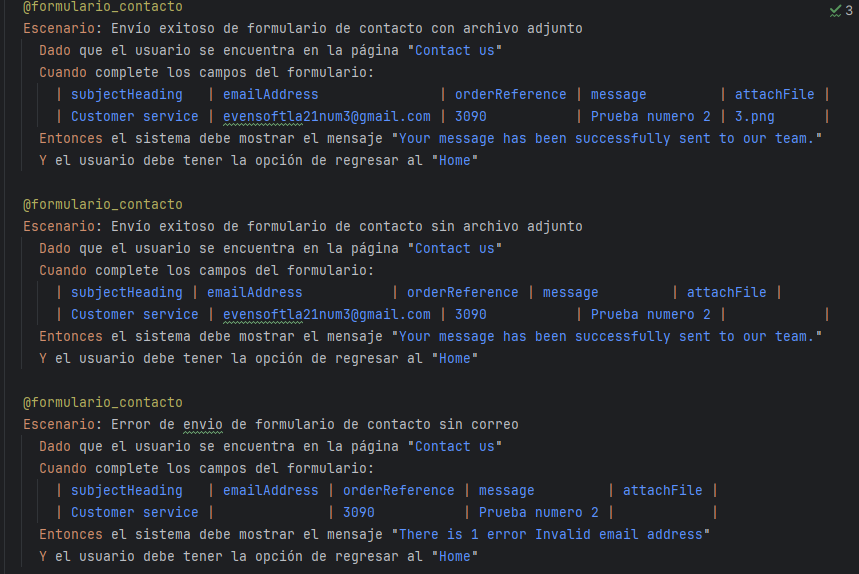

# Proyecto de Automatización - Formulario de Contacto

## Objetivo
Automatizar pruebas del formulario de contacto de Automation Practice mediante framework BDD con Cucumber y Selenium.

## Alcance
- Validación de envíos exitosos (con/sin archivos)
- Manejo de errores en campos obligatorios
- Pruebas de regresión automatizadas
- Generación de reportes de ejecución

## Tecnologías
- IntelliJ IDEA 3.4.1
- SDK 24
- Gradle 15
- Selenium WebDriver
- Cucumber
- Java 8+

## Estructura

## Escenarios

### Envío exitoso con archivo
- Dado: Usuario en página "Contact us"
- Cuando: Completa formulario con datos válidos y archivo
- Entonces: Muestra mensaje de éxito

### Error por email faltante
- Dado: Usuario en página "Contact us"
- Cuando: Completa formulario sin email
- Entonces: Muestra error "Invalid email address"
## Repositorio
### https://github.com/piter41242/Prueba_Autamizacion.git
## Comandos
- ./gradlew test
- git add .
- git commit -m "pruebas formulario contacto"
- git push origin dev/YonRuiz

## Validaciones
- Mensajes de éxito/error correctos
- Campos obligatorios validados
- Archivos adjuntos procesados
- Navegación posterior funcional

**Autor**: Piter Ruiz  
**Estado**: COMPLETADO  
**Branch**: dev/YonRuiz